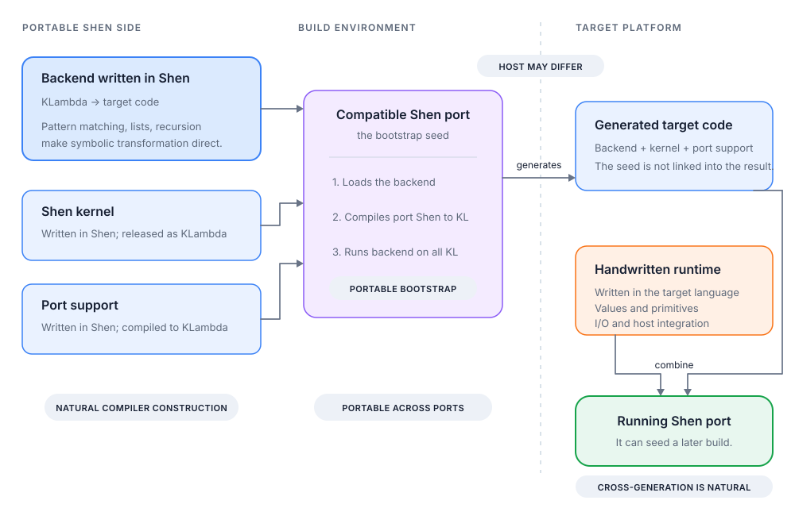

# A Proposed Architecture for Shen Ports

This document proposes a common architecture for compiled Shen ports. It is
not a requirement of Shen and it is not a description of how every existing
port is organised.

The central separation has been present since the first Shen port. The
original Common Lisp implementation, which ran on SBCL, already defined its
KLambda-to-Common Lisp backend in Shen; that backend is now found in
[`sources/backend.shen`](../sources/backend.shen). Shen/Scheme is used as the
main worked example here because it also exposes the surrounding bootstrap,
initialisation, target assembly, and generated-source distribution machinery.

The central proposal is to write each KLambda-to-target backend in Shen while
keeping the low-level runtime in the target platform's language. This has three
main advantages:

* **Handling Shen with Shen is easier.** KLambda is symbolic code. Shen's
  pattern matching, lists, recursion, symbols, and higher-order functions make
  the translation rules direct to express and easy to relate to their input.
* **Backends can use the Shen compilation environment.** A backend written in
  Shen runs inside a live Shen system, not merely over isolated KLambda data.
  It can query signatures, arities, symbol properties, packages, datatypes,
  compiler flags, and other state established during compilation. A backend
  written directly in the target language would need this information to be
  encoded in KLambda, exported separately, or exposed through a bridge.
* **Backends are portable across Shen ports.** A backend written in Shen can be
  loaded by any compatible Shen implementation. The port running the backend
  and the platform receiving its output do not have to be the same.

This separates three choices which are often unnecessarily tied together: the
Shen port used to run the build, the backend used to generate code, and the
platform on which that code will run.



In this division of labour, Shen handles symbolic transformation and provides
the build-time compilation environment, the target language supplies the
low-level runtime, and a compatible working Shen executes the backend during
the build.

During the build, the Shen-written kernel and port support become target code;
the backend can be compiled and included in the same way when the deployed port
needs it. The distinction describes how the port is authored and bootstrapped,
not necessarily how it is packaged at runtime.

The proposal applies equally to backends which generate target-language
source, emit bytecode, or produce another executable representation. For
performance choices within these components, see
[Optimising a Shen Port](port-performance.md). For changes needed between
kernel versions, see the [Port Upgrade Guide](port-upgrades.md).

## Contents

* [Why the proposal puts the backend in Shen](#why-the-proposal-puts-the-backend-in-shen)
* [The proposed implementation boundary](#the-proposed-implementation-boundary)
* [How the port is built](#how-the-port-is-built)
* [Bootstrap inputs and distributions](#bootstrap-inputs-and-distributions)
* [The KLambda-to-runtime contract](#the-klambda-to-runtime-contract)
* [Definitions, effects, and initialisation](#definitions-effects-and-initialisation)
* [Deployment](#deployment)
* [What the tests establish](#what-the-tests-establish)

## Why the proposal puts the backend in Shen

### Shen is good at transforming Shen code

KLambda arrives as structured symbolic data. A backend repeatedly recognises a
form, compiles its children, and constructs the corresponding target form. For
example, it might match a KLambda `if`, recursively compile its condition and
branches, and return the target language's conditional syntax.

Shen's pattern matching makes the input cases visible in the compiler source,
while its ordinary list and symbol operations are already the tools needed to
construct output. Compiler rules can therefore remain close to the KLambda
forms they implement instead of being spread across a target-language parser,
visitor hierarchy, or collection of tagged syntax classes.

Shen/Scheme demonstrates this in `src/compiler.shen`, where pattern-matching
rules translate KLambda forms into Scheme forms.

### Shen exposes more than KLambda

KLambda does not contain all the information available while it is being
compiled. The surrounding Shen environment may contain declarations and
metadata useful for target-specific lowering and optimisation. Since a
Shen-written backend executes in that environment, it can access this
information through ordinary Shen interfaces.

For example, a backend can retrieve a function's type signature even when no
type annotations appear in its KLambda. It can similarly inspect arities,
properties, or build configuration without duplicating the corresponding Shen
machinery in the target language.

This is a practical advantage of implementing the backend in Shen: the
frontend and backend can share compilation knowledge without introducing a
separate metadata representation or host-language API. When a backend depends
on that knowledge, however, the build must ensure that the environment
corresponds to the code being compiled.

### Portable backends decouple ports from targets

A backend written in Shen is itself a Shen program. It can be loaded into an
existing implementation and used before the new runtime exists. The seed needs
to provide the Shen frontend and whatever small build-time facilities the
backend uses, but it does not need to share the new port's target language.

This separates three roles:

1. the **seed port**, which executes Shen during the build;
2. the **backend**, which determines the generated representation; and
3. the **target runtime**, which executes that representation on its platform.

Running the backend and running its output are separate events. The seed port,
build machine, target language, and target machine can all differ.

This removes the apparent circular dependency:

```text
existing Shen + backend in Shen + kernel KLambda
    -> generated target code + target runtime
    -> new Shen implementation
```

A backend written using only portable Shen can be loaded by any compatible
Shen implementation and used to translate KLambda into code for its target
platform. Target-language operations used while the backend itself is running
create a dependency on the host implementation: a backend that calls
Scheme-specific functions, for example, cannot run on a JavaScript-based Shen
without equivalents for those functions. Such equivalents form a bootstrap
adapter. Consequently, the amount of host-specific behaviour in the backend
determines how easily other Shen implementations can use it to build the port.

This permits a many-to-many arrangement. Given suitable Shen-written backends,
one Shen port can generate code for several platforms by loading a different
backend for each target. Several Shen ports can also run the same backend and
produce equivalent output for one target. A backend can therefore become
shared Shen code rather than build machinery locked inside one port.

Cross-generation follows naturally. An existing Shen on one platform can
generate source, bytecode input, or another portable artefact for a platform on
which no Shen yet runs. The target side needs the generated output, its
handwritten runtime, and any target toolchain, but not the seed implementation.

## The proposed implementation boundary

This proposal takes KLambda as the syntactic code boundary between Shen and a
port. It does not require KLambda to be the backend's only build-time input: a
backend can also consult the Shen environment in which it runs. The Shen kernel
is authored in Shen, but kernel releases provide generated KLambda for ports to
consume. A port therefore does not ordinarily need to reimplement the Shen
reader, pattern compiler, typechecker, Prolog system, or other kernel facilities
in the target language. This boundary is versioned rather than immutable: a
kernel release can change the KLambda contract in ways that require
corresponding changes in the backend or runtime.

Under this architecture, a compiled port provides a Shen-written backend which
accepts KLambda and produces something its target can execute. That output
might be source code, host-language syntax trees, bytecode, or machine-code
input.

### The two compilers

The word *compiler* can refer to two different pieces of the system:

1. The **Shen frontend** reads Shen source, expands macros, processes packages
   and declarations, analyses applications, and produces KLambda. It is part of
   the Shen kernel.
2. The **port backend** translates KLambda into the target platform's
   executable representation. It belongs to the port.

The distinction matters because a compiled port does not need a second Shen
parser or pattern compiler. Those facilities already produce the KLambda which
the backend consumes.

### The target runtime

The target runtime implements the semantic substrate beneath generated code.
Depending on what the backend lowers directly, it usually owns some or all of:

* Shen value representations and KLambda primitives;
* global variable lookup and mutation;
* equality, hashing, and errors;
* file, stream, clock, and process operations; and
* integration with the target compiler, virtual machine, or operating system.

The runtime does not need to implement every KLambda operation as a named host
function. A backend can translate arithmetic, conditionals, local bindings,
closures, and pair operations directly to target constructs. These direct
translations and the runtime helpers together form the target-side
implementation of KLambda.

### Port-specific Shen code

Target-specific code above the primitive boundary does not all have to be
written in the target language. Overrides, command-line behaviour, and
development tools can remain in Shen and call the host through `foreign` when
necessary. They then pass through the same Shen-to-KLambda and
KLambda-to-target pipeline as the kernel. Shen/Scheme uses this arrangement for
its overrides, launcher behaviour, and native compilation tools.

## How the port is built

The proposal's choice to write the backend in Shen creates an apparent cycle:
Shen is needed to build the Shen implementation. The cycle is broken with a
working Shen used only as a build-time seed.

The seed executes the build, but the resulting program is built from the
port's sources, the selected kernel, and the target runtime. The seed is not
linked into the result.

### Seed and backend

The build begins inside the seed, which executes the build driver and provides
the Shen frontend used for port sources. Its reader, macros, and frontend can
affect the generated KLambda, so the identity of the seed is part of a
reproducible build.

The seed loads the port backend as Shen source. This creates an executable
KLambda-to-target compiler inside the seed process. The backend source is also
an input to that compiler:

```text
backend.shen -> backend.kl -> backend.target
```

The backend therefore compiles its own KLambda representation. This is
self-compilation of the backend, but the new port becomes self-hosting only
when it can run the same build itself.

### The backend's Shen environment

KLambda is the backend's explicit code input, but the backend does not have to
operate as a closed transformation over that value. Because the backend
executes inside a live Shen system, it can inspect build-time state established
by the frontend and by previously loaded code. This can include function
signatures, arities, symbol properties, packages, datatypes, feature flags, and
other compiler metadata.

This allows a backend to recover information which is not represented directly
in KLambda. For example, it can retrieve a function's signature from the Shen
type environment and use it to guide representation choices or optimisations.

Whenever generated output depends on this state, the state is also a build
input. The build driver must establish the appropriate environment before
invoking the backend. Merely reading released KLambda as data does not install
its associated metadata, and the seed's metadata may not match the kernel being
compiled when their versions differ.

Backends should distinguish required metadata from optional optimisation
information. Missing required information should produce a build-time error;
optional information should have a well-defined fallback. Portable backends
should prefer stable Shen interfaces over direct access to
implementation-specific globals.

### Port sources and kernel

Other port-owned Shen files follow the same two transformations:

```text
port source -> KLambda -> target code
```

The first transformation is performed by the Shen frontend running in the
seed. The second is performed by the loaded backend. The released kernel is
already KLambda, so it enters at the second transformation:

```text
released kernel KLambda -> target code
```

The kernel files, their initialisation, and their metadata form a versioned
set. Generated output from a different kernel release can disagree with the
definitions or initial state expected by the rest of the port.

### Initialisation and assembly

KLambda contains definitions as well as expressions which establish runtime
state. A compiled port can emit definitions statically while collecting those
effects into an ordered initialisation unit. Metadata created by loading Shen
source, such as arities, belongs to the same process.

The target toolchain then combines the generated kernel, initialisation, and
selected port components with the handwritten runtime. The backend is included
when the deployed port needs it. Depending on the target, the result may be an
executable, a virtual-machine image, a module set, or a bundle embedded in a
host application. Shen/Scheme follows this pattern by generating Scheme which
Chez compiles together with its handwritten runtime.

## Bootstrap inputs and distributions

The seed requirement belongs to development and release engineering. A source
or binary distribution can omit that requirement by carrying the generated
artefacts needed by the target-language build.

### Building from a repository checkout

A checkout without generated target code has four build inputs:

1. the selected kernel KLambda;
2. a seed Shen;
3. the port sources and build scripts, including its backend and handwritten
   runtime; and
4. the target platform's compiler or runtime tools.

### Building from generated sources

A source release can include the output of the Shen bootstrap stage. Its users
then need only the generated code, handwritten runtime, and target-language
toolchain.

Generated files in a source release are derived artefacts rather than an
independent source of truth. Their relationship to the port sources, selected
kernel, build driver, and pinned seed is what makes a release reproducible.

Shen/Scheme demonstrates both paths: its development build regenerates Scheme
with a pinned seed, while its source releases include that generated Scheme so
users do not need Shen to build the port.

### Seed compatibility

A seed can be older than the implementation it is building. The build may need
small compatibility definitions so the new backend source can be loaded by the
old reader or compiler.

These definitions belong to the bootstrap environment rather than the port
being produced. They appear in the generated runtime only when the port also
uses them independently of the bootstrap.

The size of this compatibility layer affects how easy the trusted bootstrap is
to understand. When loading the backend depends on many features of the
current runtime, the boundary between the seed and the implementation being
produced becomes difficult to identify.

## The KLambda-to-runtime contract

The port backend and target runtime together implement KLambda. Treating them
as separate projects without a shared contract leads to subtle errors: the
backend may emit a representation, helper call, or calling convention which
the runtime does not provide.

### Backend lowering and runtime operations

Every KLambda form reaches the target through one of four paths:

* translated directly into a target construct;
* emitted as a call to a runtime helper;
* represented by a dedicated target instruction or evaluator case; or
* deliberately unsupported, with a clear build-time error.

Shen/Scheme, for example, lowers control flow, closures, arithmetic, and data
access directly to Scheme while using runtime helpers for operations whose
Shen semantics are not supplied by Scheme alone.

This division is an implementation choice. What matters is that the union of
compiler lowering and runtime helpers covers KLambda semantics.

### Representations and calling conventions

Correct execution depends on a shared set of representation and calling
conventions between the runtime and compiler:

* the representation of every Shen value category;
* how function and global names are encoded in the target language;
* the calling convention for static, partial, over-, and dynamic application;
* how redefinition and arity changes affect function values; and
* the behaviour of errors and tail calls across the host boundary.

These choices are described in more detail in
[Optimising a Shen Port](port-performance.md); the architectural point is that
they are shared assumptions between the backend and runtime.

### Foreign operations

Port-owned Shen source can mark a host operation with `foreign`. The Shen
source processor avoids currying that application and removes the marker, so
the generated KLambda contains an ordinary call to the host function. The
backend then maps that name to a target binding; `foreign` itself is not a
KLambda primitive.

This mechanism supports concise overrides and platform integration, but it
also introduces another boundary between Shen and the host. Its portability
depends on how foreign names map to the target, whether the operations exist
during bootstrap as well as at runtime, and which calling convention they use.
Shen/Scheme represents this boundary with `scm.`-prefixed names.

## Definitions, effects, and initialisation

Compiling all top-level forms as if they were function definitions is not
sufficient. Loading Shen source changes the surrounding environment as well as
installing executable code.

The important distinction is:

```text
definitions  -> can usually be emitted statically
effects       -> execute later, in source or dependency order
```

Effects include setting globals, registering packages, installing macros and
types, and running library initialisers. A target which requires definitions
to precede expressions makes this separation mandatory, but it is useful for
other hosts as well because it exposes static code to their compiler.

### Preserving metadata

Source loading can install more than a callable body. Depending on the source
and artefact type, a compiled unit may also need to preserve:

* arities and lambda forms;
* packages, macros, types, and datatypes;
* source information and user-definition tracking; and
* ordered top-level effects.

The kernel distribution already provides its generated initialisation logic.
Port-owned Shen files require equivalent treatment if the final environment is
expected to behave as though those files had been loaded from source.

Shen/Scheme illustrates this by emitting arity registrations for its port
functions and collecting effects into a separate initialisation unit.

### Selecting overrides

A port can replace portable kernel definitions with implementations better
suited to the host. In this architecture, the build identifies those
replacements, omits the corresponding portable definitions, compiles the
replacements normally, and installs their metadata.

This explicit selection gives the runtime one definition for each overridden
function. By contrast, emitting both definitions and relying on load order can
leave internal calls bound to one version while user calls resolve to another,
or allow a later kernel file to silently undo the override.

Shen/Scheme follows this model by filtering overridden kernel `defun`s while
generating Scheme.

## Deployment

The finished implementation combines the handwritten runtime with target
translations of the kernel, initialisation, and selected port support or
extensions. A compiler-enabled image also retains the frontend and backend.
The word *runtime* can therefore refer either to the handwritten substrate or,
more broadly, to the complete deployed image.

The backend is necessary to build a compiled port, but it is not always
necessary to run one. Common deployment shapes include:

* **runtime-only**: execute the precompiled kernel and applications, with no
  target compiler;
* **KLambda-capable**: retain the backend or evaluator so `eval-kl` and dynamic
  definitions work;
* **source-capable**: retain both the Shen frontend and port backend so Shen
  source can be loaded or compiled.

These are packaging choices, not different language definitions. In a smaller
deployment, operations backed by an omitted compiler are unavailable unless
the corresponding dynamic code has already been compiled. The deployment
shape therefore determines which forms of loading and evaluation remain
possible at runtime.

## What the tests establish

The boundaries in this architecture create different classes of failure. A
working REPL shows that one assembled image can start, but not that the image
can be reproduced from its sources or that the backend and runtime agree in
every case. Separate tests provide evidence about separate boundaries:

* backend and linking tests cover KLambda translation and the runtime operations
  referenced by generated code;
* clean-process tests cover initialisation order, overrides, and metadata;
* application tests cover partial, over-, higher-order, and dynamic calls,
  where the backend and runtime share calling-convention assumptions;
* the kernel suite covers the resulting implementation against Shen; and
* source-release builds cover the claim that users no longer need a seed Shen.

A self-hosting build provides an additional bootstrap check by regenerating the
backend with the newly built port and comparing that output with the trusted
seed's output.

Bootstrap tests and runtime tests answer different questions. A runtime test
can pass while stale generated files conceal a broken bootstrap. Conversely, a
bootstrap can succeed while initialisation or packaging omits an artefact
needed by an installed runtime. Exercising both paths reveals failures that
either path alone can hide.
